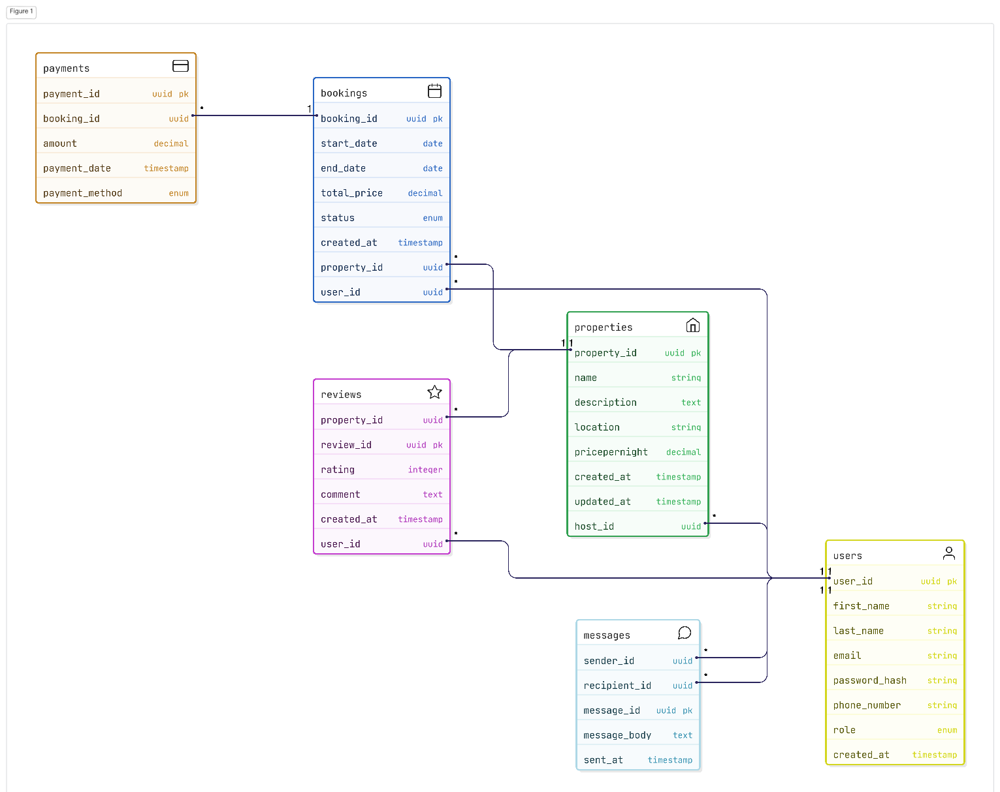

# Airbnb-clone Platform Database Schema

This document outlines the database schema for an Airbnb-clone platform, including entities, their attributes, relationships, and an Entity-Relationship (ER) diagram.

---

## Entities and Attributes

### 1. **User**
_Represents users of the platform (guests, hosts, or admins)._

| Attribute       | Type                                   | Constraints                        |
|-----------------|----------------------------------------|------------------------------------|
| `user_id`       | UUID                                   | Primary Key, Indexed               |
| `first_name`    | VARCHAR                                | NOT NULL                           |
| `last_name`     | VARCHAR                                | NOT NULL                           |
| `email`         | VARCHAR                                | UNIQUE, NOT NULL                   |
| `password_hash` | VARCHAR                                | NOT NULL                           |
| `phone_number`  | VARCHAR                                | NULL                               |
| `role`          | ENUM (`guest`, `host`, `admin`)        | NOT NULL                           |
| `created_at`    | TIMESTAMP                              | DEFAULT CURRENT_TIMESTAMP          |

---

### 2. **Property**
_Represents rentable properties listed by hosts._

| Attribute        | Type         | Constraints                                 |
|------------------|--------------|---------------------------------------------|
| `property_id`    | UUID         | Primary Key, Indexed                        |
| `host_id`        | UUID         | Foreign Key → `User.user_id`                |
| `name`           | VARCHAR      | NOT NULL                                    |
| `description`    | TEXT         | NOT NULL                                    |
| `location`       | VARCHAR      | NOT NULL                                    |
| `pricepernight`  | DECIMAL      | NOT NULL                                    |
| `created_at`     | TIMESTAMP    | DEFAULT CURRENT_TIMESTAMP                   |
| `updated_at`     | TIMESTAMP    | ON UPDATE CURRENT_TIMESTAMP                 |

---

### 3. **Booking**
_Manages reservations made by users for properties._

| Attribute      | Type      | Constraints                                 |
|----------------|-----------|---------------------------------------------|
| `booking_id`   | UUID      | Primary Key, Indexed                        |
| `property_id`  | UUID      | Foreign Key → `Property.property_id`        |
| `user_id`      | UUID      | Foreign Key → `User.user_id`                |
| `start_date`   | DATE      | NOT NULL                                    |
| `end_date`     | DATE      | NOT NULL                                    |
| `total_price`  | DECIMAL   | NOT NULL                                    |
| `status`       | ENUM (`pending`, `confirmed`, `canceled`) | NOT NULL   |
| `created_at`   | TIMESTAMP | DEFAULT CURRENT_TIMESTAMP                   |

---

### 4. **Payment**
_Records payment transactions for bookings._

| Attribute        | Type      | Constraints                                 |
|------------------|-----------|---------------------------------------------|
| `payment_id`     | UUID      | Primary Key, Indexed                        |
| `booking_id`     | UUID      | Foreign Key → `Booking.booking_id`          |
| `amount`         | DECIMAL   | NOT NULL                                    |
| `payment_date`   | TIMESTAMP | DEFAULT CURRENT_TIMESTAMP                   |
| `payment_method` | ENUM (`credit_card`, `paypal`, `stripe`) | NOT NULL   |

---

### 5. **Review**
_Stores user reviews for properties._

| Attribute      | Type      | Constraints                                 |
|----------------|-----------|---------------------------------------------|
| `review_id`    | UUID      | Primary Key, Indexed                        |
| `property_id`  | UUID      | Foreign Key → `Property.property_id`        |
| `user_id`      | UUID      | Foreign Key → `User.user_id`                |
| `rating`       | INTEGER   | CHECK (`rating` >= 1 AND `rating` <= 5), NOT NULL |
| `comment`      | TEXT      | NOT NULL                                    |
| `created_at`   | TIMESTAMP | DEFAULT CURRENT_TIMESTAMP                   |

---

### 6. **Message**
_Facilitates communication between users (e.g., host-guest)._

| Attribute      | Type      | Constraints                                 |
|----------------|-----------|---------------------------------------------|
| `message_id`   | UUID      | Primary Key, Indexed                        |
| `sender_id`    | UUID      | Foreign Key → `User.user_id`                |
| `recipient_id` | UUID      | Foreign Key → `User.user_id`                |
| `message_body` | TEXT      | NOT NULL                                    |
| `sent_at`      | TIMESTAMP | DEFAULT CURRENT_TIMESTAMP                   |

---

## Relationships Between Entities

| Relationship                | Type         | Description                                                                                  | Connection                                      |
|-----------------------------|--------------|----------------------------------------------------------------------------------------------|-------------------------------------------------|
| **User ↔ Property**         | One-to-Many  | A user (host) can list multiple properties; each property has one host.                      | `Property.host_id` → `User.user_id`             |
| **User ↔ Booking**          | One-to-Many  | A user (guest) can make multiple bookings; each booking has one user.                        | `Booking.user_id` → `User.user_id`              |
| **Property ↔ Booking**      | One-to-Many  | A property can have multiple bookings; each booking has one property.                        | `Booking.property_id` → `Property.property_id`   |
| **Booking ↔ Payment**       | 1:1 or 1:N   | Each booking has at least one payment; each payment is for one booking.                      | `Payment.booking_id` → `Booking.booking_id`      |
| **User ↔ Review**           | One-to-Many  | A user can leave multiple reviews; each review is by one user.                               | `Review.user_id` → `User.user_id`               |
| **Property ↔ Review**       | One-to-Many  | A property can have multiple reviews; each review is for one property.                       | `Review.property_id` → `Property.property_id`    |
| **User ↔ Message (Sender)** | One-to-Many  | A user can send multiple messages; each message has one sender.                              | `Message.sender_id` → `User.user_id`            |
| **User ↔ Message (Recipient)** | One-to-Many | A user can receive multiple messages; each message has one recipient.                        | `Message.recipient_id` → `User.user_id`         |

---

## ER Diagram

The ER diagram visually represents the entities, their attributes, and relationships.  
Entities are rectangles, attributes are listed inside, and relationships are lines with cardinality (e.g., 1:N).

- **Entities:** `User`, `Property`, `Booking`, `Payment`, `Review`, `Message`
- **Attributes:** Listed inside rectangles; primary keys _underlined_, foreign keys marked with _(FK)_
- **Relationships:** Lines with cardinality (e.g., 1:N for User to Property)
- **Constraints:** Noted where applicable (e.g., UNIQUE on `User.email`, CHECK on `Review.rating`)

---

## Notes

- The schema supports core Airbnb-clone functionality: user management, property listings, bookings, payments, reviews, and messaging.
- Indexes on primary keys and foreign keys (e.g., `email`, `property_id`, `booking_id`) optimize query performance.
- **Recommended constraints:**
  - `end_date > start_date` in `Booking`
  - Unique constraint on (`property_id`, `user_id`) in `Review` to prevent duplicate reviews
- The ER diagram assumes a logical representation; adjust styling in Draw.io for clarity (e.g., color-coding entities or relationships).
